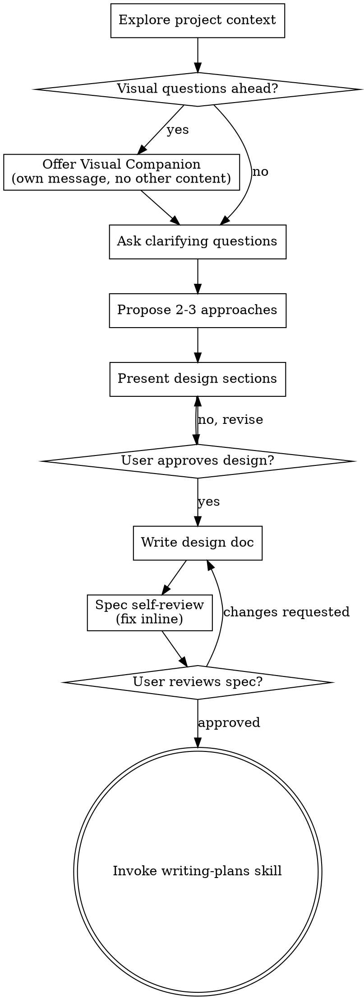

<!-- Generated by SpecStory, Markdown v2.1.0 -->

# 2026-05-02 21:58:35+0800

<!-- Codex CLI Session 019de8fa-fb85-78e1-9cca-3fe8497d678b (2026-05-02 21:58:35+0800) -->

_**User (2026-05-02 21:58:35+0800)**_

# Context from my IDE setup:

## Active file: README.md

## My request for Codex:
[$brainstorming](C:\\Users\\User\\我的雲端硬碟\\skills\\brainstorming\\SKILL.md) 首頁想要加上動態背景的功能


---

_**Agent (gpt-5.5 2026-05-02 21:58:44+0800)**_

使用 `brainstorming` skill 先釐清「動態背景」的意圖與可行實作，再檢查首頁技術棧與現有版面，之後直接落地一個低風險版本。

_**Agent (gpt-5.5 2026-05-02 21:58:45+0800)**_

<tool-use data-tool-type="shell" data-tool-name="shell_command"><details>
<summary>Tool use: **shell_command** `Get-Content -LiteralPath 'C:\Users\User\我的雲端硬碟\skills\brainstorming\SKILL.md' -TotalCount 220; Write-Output '---FILES---'; Get-ChildItem -Force; Write-Output '---README---'; Get-Content -LiteralPath README.md -TotalCount 120`</summary>
```
Exit code: 0
Wall time: 0.3 seconds
Output:
---
name: brainstorming
description: "You MUST use this before any creative work - creating features, building components, adding functionality, or modifying behavior. Explores user intent, requirements and design before implementation."
---

# Brainstorming Ideas Into Designs

Help turn ideas into fully formed designs and specs through natural collaborative dialogue.

Start by understanding the current project context, then ask questions one at a time to refine the idea. Once you understand what you're building, present the design and get user approval.

<HARD-GATE>
Do NOT invoke any implementation skill, write any code, scaffold any project, or take any implementation action until you have presented a design and the user has approved it. This applies to EVERY project regardless of perceived simplicity.
</HARD-GATE>

## Anti-Pattern: "This Is Too Simple To Need A Design"

Every project goes through this process. A todo list, a single-function utility, a config change ??all of them. "Simple" projects are where unexamined assumptions cause the most wasted work. The design can be short (a few sentences for truly simple projects), but you MUST present it and get approval.

## Checklist

You MUST create a task for each of these items and complete them in order:

1. **Explore project context** ??check files, docs, recent commits
2. **Offer visual companion** (if topic will involve visual questions) ??this is its own message, not combined with a clarifying question. See the Visual Companion section below.
3. **Ask clarifying questions** ??one at a time, understand purpose/constraints/success criteria
4. **Propose 2-3 approaches** ??with trade-offs and your recommendation
5. **Present design** ??in sections scaled to their complexity, get user approval after each section
6. **Write design doc** ??save to `docs/superpowers/specs/YYYY-MM-DD-<topic>-design.md` and commit
7. **Spec self-review** ??quick inline check for placeholders, contradictions, ambiguity, scope (see below)
8. **User reviews written spec** ??ask user to review the spec file before proceeding
9. **Transition to implementation** ??invoke writing-plans skill to create implementation plan

## Process Flow



**The terminal state is invoking writing-plans.** Do NOT invoke frontend-design, mcp-builder, or any other implementation skill. The ONLY skill you invoke after brainstorming is writing-plans.

## The Process

**Understanding the idea:**

- Check out the current project state first (files, docs, recent commits)
- Before asking detailed questions, assess scope: if the request describes multiple independent subsystems (e.g., "build a platform with chat, file storage, billing, and analytics"), flag this immediately. Don't spend questions refining details of a project that needs to be decomposed first.
- If the project is too large for a single spec, help the user decompose into sub-projects: what are the independent pieces, how do they relate, what order should they be built? Then brainstorm the first sub-project through the normal design flow. Each sub-project gets its own spec ??plan ??implementation cycle.
- For appropriately-scoped projects, ask questions one at a time to refine the idea
- Prefer multiple choice questions when possible, but open-ended is fine too
- Only one question per message - if a topic needs more exploration, break it into multiple questions
- Foc
... (truncated)
```
</details></tool-use>

_**Agent (gpt-5.5 2026-05-02 21:58:49+0800)**_

Some of what we're working on might be easier to explain if I can show it to you in a web browser. I can put together mockups, diagrams, comparisons, and other visuals as we go. This feature is still new and can be token-intensive. Want to try it? (Requires opening a local URL)

_**Agent (gpt-5.5 2026-05-02 21:58:50+0800)**_

Which dynamic background direction do you want for the homepage?

1. `Ambient particles`：延續現有作品集科技感，低干擾、效能穩。
2. `Gradient blobs`：柔和流動色塊，比較設計感，適合個人品牌。
3. `Interactive cursor field`：滑鼠移動會影響背景，較有玩具感但要更注意手機與效能。

---

_**User (2026-05-02 22:00:38+0800)**_

# Context from my IDE setup:

## Active file: README.md

## My request for Codex:
能夠有範例嗎?


---

_**Agent (gpt-5.5 2026-05-02 22:00:45+0800)**_

我先看首頁現有背景與 JS 動畫結構，範例會對齊目前網站，而不是講抽象效果。

_**Agent (gpt-5.5 2026-05-02 22:00:45+0800)**_

<tool-use data-tool-type="shell" data-tool-name="shell_command"><details>
<summary>Tool use: **shell_command** `Get-Content -LiteralPath index.html -TotalCount 220`</summary>
```
Exit code: 0
Wall time: 0.2 seconds
Output:
<!DOCTYPE html>
<html lang="zh-TW">
<head>
  <meta charset="UTF-8" />
  <meta name="viewport" content="width=device-width, initial-scale=1.0" />
  <title>Wua Studio</title>
  <link rel="preconnect" href="https://fonts.googleapis.com" />
  <link rel="preconnect" href="https://fonts.gstatic.com" crossorigin />
  <link href="https://fonts.googleapis.com/css2?family=Nunito:wght@400;600;700;800&family=Noto+Sans+TC:wght@400;500;700&display=swap" rel="stylesheet" />
  <link rel="stylesheet" href="style.css" />
</head>
<body>
  <canvas id="particle-canvas"></canvas>

  <!-- Hero -->
  <section id="hero">
    <div class="floating-icons" aria-hidden="true"></div>
    <div class="hero-content">
      <h1 class="hero-name">?喳???<span>繚 Adalf Wu</span></h1>
      <p class="hero-tagline">??vibe coding ??鈭?撌亙<br><em>Building warm & playful things with vibe coding</em></p>
    </div>
    <button class="scroll-hint" aria-label="頝唾雿??? onclick="document.getElementById('projects').scrollIntoView({behavior:'smooth'})">??/button>
  </section>

  <!-- Projects -->
  <section id="projects">
    <h2 class="section-title">雿???<span>繚 Projects</span></h2>
    <div class="projects-grid" id="projects-grid"></div>
  </section>

  <!-- About -->
  <section id="about">
    <div class="about-card">
      <h2 class="section-title">???<span>繚 About</span></h2>
      <p>??甇∪鼠?拙鈭綽??€隞交???vibe coding ??鈭?撌亙???拙嚗????霈???瘣餅?閎銝€暺€?/p>
      <p><em>I love helping people. I build small tools and toys with vibe coding, hoping they bring a little more joy to your day.</em></p>
      <div class="contact-links">
        <a href="https://github.com/adalf0722" target="_blank" rel="noopener" class="contact-btn">
          <svg width="18" height="18" viewBox="0 0 24 24" fill="currentColor"><path d="M12 0C5.37 0 0 5.37 0 12c0 5.31 3.435 9.795 8.205 11.385.6.105.825-.255.825-.57 0-.285-.015-1.23-.015-2.235-3.015.555-3.795-.735-4.035-1.41-.135-.345-.72-1.41-1.23-1.695-.42-.225-1.02-.78-.015-.795.945-.015 1.62.87 1.845 1.23 1.08 1.815 2.805 1.305 3.495.99.105-.78.42-1.305.765-1.605-2.67-.3-5.46-1.335-5.46-5.925 0-1.305.465-2.385 1.23-3.225-.12-.3-.54-1.53.12-3.18 0 0 1.005-.315 3.3 1.23.96-.27 1.98-.405 3-.405s2.04.135 3 .405c2.295-1.56 3.3-1.23 3.3-1.23.66 1.65.24 2.88.12 3.18.765.84 1.23 1.905 1.23 3.225 0 4.605-2.805 5.625-5.475 5.925.435.375.81 1.095.81 2.22 0 1.605-.015 2.895-.015 3.3 0 .315.225.69.825.57A12.02 12.02 0 0 0 24 12c0-6.63-5.37-12-12-12z"/></svg>
          GitHub
        </a>
        <a href="mailto:shaq.adalf@gmail.com" class="contact-btn">
          <svg width="18" height="18" viewBox="0 0 24 24" fill="none" stroke="currentColor" stroke-width="2"><rect x="2" y="4" width="20" height="16" rx="2"/><path d="m2 7 10 7 10-7"/></svg>
          Email
        </a>
      </div>
    </div>
  </section>

  <footer>
    <p>穢 2026 Adalf Wu 繚 Made with ??& vibe coding</p>
  </footer>

  <script src="script.js"></script>
</body>
</html>
```
</details></tool-use>

_**Agent (gpt-5.5 2026-05-02 22:00:45+0800)**_

<tool-use data-tool-type="shell" data-tool-name="shell_command"><details>
<summary>Tool use: **shell_command** `Get-Content -LiteralPath style.css -TotalCount 260`</summary>
```
Exit code: 0
Wall time: 0.2 seconds
Output:
/* ?€?€ Variables ?€?€ */
:root {
  --bg: #FDF6EC;
  --text: #3D2B1F;
  --text-muted: #8B6A57;
  --card-yellow: #FFF3B0;
  --card-orange: #FFD9A0;
  --card-pink: #FFD1C1;
  --card-green: #D4EDDA;
  --accent: #F4A261;
  --accent2: #E9C46A;
  --shadow: rgba(61, 43, 31, 0.12);
  --shadow-hover: rgba(61, 43, 31, 0.22);
  --radius: 4px;
}

/* ?€?€ Reset ?€?€ */
*, *::before, *::after { box-sizing: border-box; margin: 0; padding: 0; }

html { scroll-behavior: smooth; }

body {
  background: var(--bg);
  color: var(--text);
  font-family: 'Nunito', 'Noto Sans TC', sans-serif;
  overflow-x: hidden;
  line-height: 1.7;
}

/* ?€?€ Particle Canvas ?€?€ */
#particle-canvas {
  position: fixed;
  inset: 0;
  pointer-events: none;
  z-index: 0;
}

/* ?€?€ Hero ?€?€ */
#hero {
  position: relative;
  min-height: 100vh;
  display: flex;
  align-items: center;
  justify-content: center;
  overflow: hidden;
  z-index: 1;
}

.floating-icons {
  position: absolute;
  inset: 0;
  pointer-events: none;
}

.float-icon {
  position: absolute;
  font-size: 1.5rem;
  opacity: 0.25;
  user-select: none;
  will-change: transform;
  transition: transform 0.1s linear;
}

.hero-content {
  text-align: center;
  z-index: 2;
  padding: 2rem;
}

.hero-name {
  font-size: clamp(2rem, 6vw, 3.5rem);
  font-weight: 800;
  letter-spacing: -0.5px;
  margin-bottom: 1rem;
}

.hero-name span {
  color: var(--accent);
}

.hero-name .char {
  display: inline-block;
  cursor: default;
}

.hero-name .char.accent-char {
  color: var(--accent);
}

.hero-name .char.pop {
  animation: elasticPop 0.5s cubic-bezier(0.34, 1.8, 0.64, 1) forwards;
}

@keyframes elasticPop {
  0%   { transform: translateY(0) scale(1); }
  40%  { transform: translateY(-18px) scale(1.15); }
  70%  { transform: translateY(4px) scale(0.95); }
  100% { transform: translateY(0) scale(1); }
}

.hero-tagline {
  font-size: clamp(1rem, 2.5vw, 1.2rem);
  color: var(--text-muted);
  line-height: 1.9;
}

.hero-tagline em {
  font-style: normal;
  opacity: 0.7;
  font-size: 0.9em;
}

.scroll-hint {
  position: absolute;
  bottom: 2rem;
  left: 50%;
  transform: translateX(-50%);
  font-size: 1.5rem;
  color: var(--accent);
  animation: bounce 2s infinite;
  z-index: 2;
  background: none;
  border: 2px solid var(--accent);
  border-radius: 50%;
  width: 2.6rem;
  height: 2.6rem;
  display: flex;
  align-items: center;
  justify-content: center;
  cursor: pointer;
  transition: background 0.2s, color 0.2s, transform 0.15s, box-shadow 0.2s;
  box-shadow: 0 2px 10px rgba(244,162,97,0.2);
}

.scroll-hint:hover {
  background: var(--accent);
  color: white;
  box-shadow: 0 4px 16px rgba(244,162,97,0.45);
}

.scroll-hint:active {
  transform: translateX(-50%) scale(0.9);
}

@keyframes bounce {
  0%, 100% { transform: translateX(-50%) translateY(0) scale(1); }
  50% { transform: translateX(-50%) translateY(8px) scale(1); }
}

/* ?€?€ Section Titles ?€?€ */
.section-title {
  font-size: clamp(1.4rem, 4vw, 2rem);
  font-weight: 800;
  margin-bottom: 2.5rem;
  text-align: center;
}

.section-title span {
  color: var(--accent);
  font-weight: 600;
}

/* ?€?€ Projects ?€?€ */
#projects {
  position: relative;
  z-index: 1;
  padding: 5rem 2rem 6rem;
  max-width: 1200px;
  margin: 0 auto;
}

.projects-grid {
  display: grid;
  grid-template-columns: repeat(3, 1fr);
  gap: 2rem;
  align-items: start;
}

/* ?€?€ Project Card ?€?€ */
.project-card {
  border-radius: 6px;
  padding: 0;
  cursor: default;
  will-change: transform;
  transition: transform 0.4s cubic-bezier(0.34, 1.56, 0.64, 1);
  box-shadow: 4px 6px 20px var(--shadow);
  opacity: 0;
  transform: translateY(40px) rotate(var(--tilt));
  perspective: 700px;
}

.project-card.visible {
  animation: cardIn 0.5s cubic-bezier(0.34, 1.56, 0.64, 1) forwards;
}

@keyframes cardIn {
  to {
    opacity: 1;
    transform: translateY(var(--offset-y, 0px)) rotate(var(--tilt));
  }
}

/* ?€?€ Flip inner ?€?€ */
.flip-inner {
  width: 100%;
  position: relative;
  transform-style: preserve-3d;
  transition: transform 0.45s cubic-bezier(0.4, 0, 0.2, 1);
  border-radius: 6px;
}

.project-card:hover .flip-inner {
  transform: rotateY(180deg);
}

.flip-front,
.flip-back {
  backface-visibility: hidden;
  -webkit-backface-visibility: hidden;
  border-radius: 6px;
  overflow: hidden;
}

.flip-front {
  width: 100%;
}

.flip-back {
  position: absolute;
  inset: 0;
  transform: rotateY(180deg);
  background: var(--text);
  color: #fff;
  display: flex;
  flex-direction: column;
  padding: 1.2rem 1.4rem;
  gap: 0.3rem;
}

.back-tag {
  font-size: 0.65rem;
  font-weight: 700;
  text-transform: uppercase;
  letter-spacing: 1px;
  color: rgba(255, 255, 255, 
... (truncated)
```
</details></tool-use>

_**Agent (gpt-5.5 2026-05-02 22:00:45+0800)**_

<tool-use data-tool-type="shell" data-tool-name="shell_command"><details>
<summary>Tool use: **shell_command** `Get-Content -LiteralPath script.js -TotalCount 260`</summary>
```
Exit code: 0
Wall time: 0.2 seconds
Output:
/* ?€?€ Project Data ?€?€ */
const projects = [
  {
    name: "imgduck",
    nameEn: "Image Duck",
    desc: "?函€汗?冽?啣?蝮桀????舀憭車?澆?嚗?銝隞颱?鞈?",
    descEn: "Browser-based image compression ??all processing stays on your device",
    tag: "tool",
    image: "assets/imgduck.webp",
    demo: "https://adalf0722.github.io/imgduck/",
    repo: "https://github.com/adalf0722/imgduck"
  },
  {
    name: "XML Diff Tool",
    nameEn: "XML Diff Tool",
    desc: "敹恍€?頛隞?XML ?辣?榆?堆?銝€?潛??箏鋆∩???,
    descEn: "Instantly compare two XML files and highlight every difference",
    tag: "tool",
    image: "assets/xml_diff_tool.webp",
    demo: "https://adalf0722.github.io/xml_diff_tool/",
    repo: "https://github.com/adalf0722/xml_diff_tool"
  },
  {
    name: "Prompt Planet",
    nameEn: "Prompt Planet",
    desc: "????鈭怠祕??AI Prompt嚗翰??啣?湔雿輻?極雿?蝔?,
    descEn: "A curated library of practical AI prompts ??find and share ready-to-use workflows",
    tag: "tool",
    image: "assets/prompt_planet.webp",
    demo: "https://prompts.shaq-adalf.workers.dev/"
  },
  {
    name: "PDF 頧?Word",
    nameEn: "PDF to Word",
    desc: "?祥蝺?撌亙嚗? PDF 銝€?菔????舐楊頛舐? Word ?辣",
    descEn: "Free online converter ??turn any PDF into an editable .docx in one click",
    tag: "tool",
    image: "assets/pdf2word.webp",
    demo: "https://pdf2word-oe9v.onrender.com/"
  },
  {
    name: "Insider News",
    nameEn: "Insider News",
    desc: "?啗???嚗翰???⊥平?????砍?€?唳???,
    descEn: "Internal news aggregator  ??stay on top of industry updates",
    tag: "tool",
    image: "assets/insider_news.webp",
    demo: "https://gamecorp-insider-news.pages.dev/",
    repo: "https://github.com/adalf0722/insider-news"
  }
  // ?啣?撠?嚗?ㄐ??蝑隞嗅??
  // { name: "", nameEn: "", desc: "", descEn: "", tag: "tool"|"toy", emoji: "??, image: "assets/xxx.webp", demo: "...", repo: "..." }
];

/* ?€?€ Render Projects ?€?€ */
function renderProjects() {
  const grid = document.getElementById('projects-grid');
  grid.innerHTML = '';

  projects.forEach((p) => {
    const card = document.createElement('article');
    card.className = 'project-card';

    // Image or placeholder
    let imageHtml = '';
    if (p.image) {
      imageHtml = ``;
    } else {
      imageHtml = `<div class="card-image-placeholder">${p.emoji || '??}</div>`;
    }

    // Back-face links
    const hasDemo = !!p.demo;
    const hasRepo = !!p.repo;
    const demoBtn = hasDemo
      ? `<a href="${p.demo}" target="_blank" rel="noopener" class="back-btn primary">
          <svg width="13" height="13" viewBox="0 0 24 24" fill="none" stroke="currentColor" stroke-width="2.5"><path d="M18 13v6a2 2 0 0 1-2 2H5a2 2 0 0 1-2-2V8a2 2 0 0 1 2-2h6"/><polyline points="15 3 21 3 21 9"/><line x1="10" y1="14" x2="21" y2="3"/></svg>
          ??撌亙
         </a>`
      : '';
    const repoBtn = hasRepo
      ? `<a href="${p.repo}" target="_blank" rel="noopener" class="back-btn" aria-label="GitHub">
          <svg width="13" height="13" viewBox="0 0 24 24" fill="currentColor"><path d="M12 0C5.37 0 0 5.37 0 12c0 5.31 3.435 9.795 8.205 11.385.6.105.825-.255.825-.57 0-.285-.015-1.23-.015-2.235-3.015.555-3.795-.735-4.035-1.41-.135-.345-.72-1.41-1.23-1.695-.42-.225-1.02-.78-.015-.795.945-.015 1.62.87 1.845 1.23 1.08 1.815 2.805 1.305 3.495.99.105-.78.42-1.305.765-1.605-2.67-.3-5.46-1.335-5.46-5.925 0-1.305.465-2.385 1.23-3.225-.12-.3-.54-1.53.12-3.18 0 0 1.005-.315 3.3 1.23.96-.27 1.98-.405 3-.405s2.04.135 3 .405c2.295-1.56 3.3-1.23 3.3-1.23.66 1.65.24 2.88.12 3.18.765.84 1.23 1.905 1.23 3.225 0 4.605-2.805 5.625-5.475 5.925.435.375.81 1.095.81 2.22 0 1.605-.015 2.895-.015 3.3 0 .315.225.69.825.57A12.02 12.02 0 0 0 24 12c0-6.63-5.37-12-12-12z"/></svg>
          GitHub
         </a>`
      : '';
    const backLinksHtml = (hasDemo || hasRepo)
      ? `<div class="back-links">${demoBtn}${repoBtn}</div>`
      : '';

    const tagLabel = p.tag === 'tool' ? '? 撌亙 Tool' : '? ?拙 Toy';

    card.innerHTML = `
      <div class="flip-inner">
        <div class="flip-front">
          ${imageHtml}
          <div class="card-body">
            <span class="card-tag">${tagLabel}</span>
            <h3 class="card-name">${p.name}</h3>
            <p class="card-name-en">${p.nameEn}</p>
            <p class="card-desc">${p.desc}</p>
            <p class="card-desc-en">${p.descEn}</p>
          </div>
        </div>
        <div class="flip-back">
          <div class="back-tag">${tagLabel}</div>
          <div class="back-name">${
... (truncated)
```
</details></tool-use>

_**Agent (gpt-5.5 2026-05-02 22:00:55+0800)**_

可以。以你現在首頁的暖色、手作感、作品卡片風格來看，我會給這 3 種範例方向：

1. `暖色浮游粒子`
   背景有淡淡的圓點、星星、符號慢慢漂浮。滑鼠移動時會產生少量粒子。
   適合：保留現在 playful / vibe coding 感覺。
   風險低，因為你目前已經有 `particle-canvas` 和浮動 icon 結構。

2. `流動漸層泡泡`
   首頁背景有幾個大型柔和色塊，例如橘色、奶油黃、粉色，緩慢漂移、變形、模糊。
   適合：讓首頁更有設計感，但不搶文字。
   我推薦這個，因為它會明顯提升視覺，但效能比大量粒子穩。

3. `互動式光暈背景`
   滑鼠附近出現一圈柔和光暈，跟著游標移動；手機版改成自動慢速移動。
   適合：想讓首頁有「活的」感覺。
   缺點是要小心不要太花，避免影響閱讀。

我的建議版本是：`流動漸層泡泡 + 少量現有粒子保留`。

效果大概是：首頁底色還是米色，後方有 3 到 5 個半透明暖色 blob 緩慢漂移，滑鼠移動時仍有小粒子點綴。這樣既有動態背景，又不會讓作品集變成太吵的特效頁。

你想要哪個方向？`1`、`2`、`3`，或我直接用推薦的 `2`。

---

_**User (2026-05-02 22:01:49+0800)**_

# Context from my IDE setup:

## Active file: README.md

## My request for Codex:
2


---

_**Agent (gpt-5.5 2026-05-02 22:01:53+0800)**_

你選的是 `流動漸層泡泡`。我會先把它收斂成短設計，等你確認後才開始改檔，避免直接把視覺方向寫死。

_**Agent (gpt-5.5 2026-05-02 22:01:57+0800)**_

設計提案：

首頁新增一層 `.ambient-bg` 動態背景，放在 `#hero` 裡、文字與浮動 icon 後方。它由 4 個大型半透明色塊組成，使用目前網站的暖色系：橘、奶油黃、粉、淡綠。色塊會用 CSS `@keyframes` 緩慢漂移與縮放，搭配 `filter: blur()` 做柔和感。

行為：
- 桌機：blob 緩慢流動，營造動態但不干擾閱讀。
- 手機：保留動畫但降低尺寸與透明度。
- `prefers-reduced-motion: reduce`：停止動畫，避免可及性問題。
- 現有 `particle-canvas` 和浮動 icon 保留，不重寫 JS。

預期檔案：
- `index.html`：在 hero 加入背景容器。
- `style.css`：新增 blob 樣式、動畫、響應式與 reduced motion。

這樣設計可以嗎？你回 `可以` 後我就開始實作。

---

_**User (2026-05-02 22:02:14+0800)**_

# Context from my IDE setup:

## Active file: README.md

## My request for Codex:
可以


---

_**Agent (gpt-5.5 2026-05-02 22:02:22+0800)**_

設計已確認。依 `brainstorming` 流程，我先把這個短規格寫進專案文件並提交，讓實作範圍固定下來；提交後再等你確認是否直接進入實作。

_**Agent (gpt-5.5 2026-05-02 22:02:22+0800)**_

<tool-use data-tool-type="shell" data-tool-name="shell_command"><details>
<summary>Tool use: **shell_command** `Get-Content -LiteralPath 'C:\Users\User\.agents\skills\commit-message-helper\SKILL.md' -TotalCount 180`</summary>
```
Exit code: 0
Wall time: 0.1 seconds
Output:
---
name: commit-message-helper
description: Helps write Git commit messages following the Conventional Commits specification. Use this skill when the user asks to commit changes, write commit messages, or mentions git commits.
---

# Commit Message Helper

When writing commit messages, follow these rules:

## Format

<type>(<scope>): <subject>

<body>

<footer>

## Types

- feat: A new feature
- fix: A bug fix
- docs: Documentation only changes
- style: Changes that do not affect the meaning of the code
- refactor: A code change that neither fixes a bug nor adds a feature
- perf: A code change that improves performance
- test: Adding missing tests or correcting existing tests
- chore: Changes to the build process or auxiliary tools

## Guidelines

1. Subject line should be no longer than 50 characters
2. Use imperative mood ("add feature" not "added feature")
3. Do not end the subject line with a period
4. Separate subject from body with a blank line
5. Use the body to explain what and why, not how

## Examples

Good:
feat(auth): add OAuth2 login support

Implement OAuth2 authentication flow to allow users to log in
with their Google or GitHub accounts.

Closes #123

Bad:
updated stuff

## Validation

Before committing, resolve the script path relative to this skill folder, not the user's current project directory.

If the skill folder is available at `$SKILL_DIR`, run:

```bash
python "$SKILL_DIR/scripts/validate_commit.py" "your commit message"
```

In PowerShell, resolve the skill directory first and then invoke the script from there:

```powershell
$skillDir = "path\to\commit-message-helper"
python (Join-Path $skillDir "scripts/validate_commit.py") "your commit message"
```
```
</details></tool-use>

_**Agent (gpt-5.5 2026-05-02 22:02:22+0800)**_

<tool-use data-tool-type="shell" data-tool-name="shell_command"><details>
<summary>Tool use: **shell_command** `git status --short`</summary>
```
Exit code: 0
Wall time: 0.1 seconds
Output:
?? .specstory/
```
</details></tool-use>

_**Agent (gpt-5.5 2026-05-02 22:02:22+0800)**_

<tool-use data-tool-type="shell" data-tool-name="shell_command"><details>
<summary>Tool use: **shell_command** `Get-Date -Format yyyy-MM-dd`</summary>
```
Exit code: 0
Wall time: 0.1 seconds
Output:
2026-05-02
```
</details></tool-use>

_**Agent (gpt-5.5 2026-05-02 22:02:26+0800)**_

工作區目前只有未追蹤的 `.specstory/`，我不會碰它。接下來只新增設計規格檔，並且提交這個文件。

_**Agent (gpt-5.5 2026-05-02 22:02:37+0800)**_

<tool-use data-tool-type="shell" data-tool-name="shell_command"><details>
<summary>Tool use: **shell_command**</summary>
```bash
New-Item -ItemType Directory -Force -Path 'docs\superpowers\specs' | Out-Null
@'
# Homepage Ambient Blob Background Design

Date: 2026-05-02

## Goal

Add a dynamic background to the homepage hero that makes the first screen feel warmer and more alive without reducing readability or making the site feel like an effects demo.

## Chosen Direction

Use flowing gradient blobs behind the hero content. The blobs should match the existing warm palette: orange, cream yellow, soft pink, and muted green.

## User Experience

- The hero keeps its current layout, typography, floating icons, and particle canvas.
- Four large translucent blobs sit behind the hero text and slowly drift, scale, and overlap.
- The motion should be subtle and slow so the headline remains the visual priority.
- On mobile, blobs become smaller and slightly less prominent.
- If the visitor has reduced motion enabled, blob animation stops.

## Implementation Scope

### HTML

Add one decorative background container inside `#hero`, before the existing floating icon layer.

Expected structure:

```html
<div class="ambient-bg" aria-hidden="true">
  <span class="ambient-blob blob-one"></span>
  <span class="ambient-blob blob-two"></span>
  <span class="ambient-blob blob-three"></span>
  <span class="ambient-blob blob-four"></span>
</div>
```

### CSS

Add styles for:

- `.ambient-bg` as an absolute full-hero layer behind hero content.
- `.ambient-blob` shared visual treatment: position, border radius, blur, opacity, gradient, and animation.
- Individual blob placement, size, colors, delay, and duration.
- `@keyframes blobFloat` for slow translate and scale changes.
- Mobile adjustments under the existing responsive breakpoint style.
- `prefers-reduced-motion: reduce` to disable blob animation.

### JavaScript

No new JavaScript is required. Existing particle and floating icon behavior stays unchanged.

## Constraints

- Do not remove or rewrite the current particle canvas.
- Keep the feature decorative and non-interactive for now.
- Do not introduce new dependencies.
- Keep implementation contained to `index.html` and `style.css`.

## Acceptance Criteria

- Homepage hero shows visible but subtle moving gradient blobs.
- Hero text remains easy to read on desktop and mobile.
- No horizontal overflow is introduced.
- Reduced-motion users see a static background.
- Existing project cards, particles, and scrolling behavior continue to work.
'@ | Set-Content -LiteralPath 'docs\superpowers\specs\2026-05-02-homepage-ambient-blob-background-design.md' -Encoding UTF8
Get-Content -LiteralPath 'docs\superpowers\specs\2026-05-02-homepage-ambient-blob-background-design.md' -TotalCount 220
```
```
Exit code: 0
Wall time: 0.2 seconds
Output:
# Homepage Ambient Blob Background Design

Date: 2026-05-02

## Goal

Add a dynamic background to the homepage hero that makes the first screen feel warmer and more alive without reducing readability or making the site feel like an effects demo.

## Chosen Direction

Use flowing gradient blobs behind the hero content. The blobs should match the existing warm palette: orange, cream yellow, soft pink, and muted green.

## User Experience

- The hero keeps its current layout, typography, floating icons, and particle canvas.
- Four large translucent blobs sit behind the hero text and slowly drift, scale, and overlap.
- The motion should be subtle and slow so the headline remains the visual priority.
- On mobile, blobs become smaller and slightly less prominent.
- If the visitor has reduced motion enabled, blob animation stops.

## Implementation Scope

### HTML

Add one decorative background container inside `#hero`, before the existing floating icon layer.

Expected structure:

```html
<div class="ambient-bg" aria-hidden="true">
  <span class="ambient-blob blob-one"></span>
  <span class="ambient-blob blob-two"></span>
  <span class="ambient-blob blob-three"></span>
  <span class="ambient-blob blob-four"></span>
</div>
```

### CSS

Add styles for:

- `.ambient-bg` as an absolute full-hero layer behind hero content.
- `.ambient-blob` shared visual treatment: position, border radius, blur, opacity, gradient, and animation.
- Individual blob placement, size, colors, delay, and duration.
- `@keyframes blobFloat` for slow translate and scale changes.
- Mobile adjustments under the existing responsive breakpoint style.
- `prefers-reduced-motion: reduce` to disable blob animation.

### JavaScript

No new JavaScript is required. Existing particle and floating icon behavior stays unchanged.

## Constraints

- Do not remove or rewrite the current particle canvas.
- Keep the feature decorative and non-interactive for now.
- Do not introduce new dependencies.
- Keep implementation contained to `index.html` and `style.css`.

## Acceptance Criteria

- Homepage hero shows visible but subtle moving gradient blobs.
- Hero text remains easy to read on desktop and mobile.
- No horizontal overflow is introduced.
- Reduced-motion users see a static background.
- Existing project cards, particles, and scrolling behavior continue to work.
```
</details></tool-use>

_**Agent (gpt-5.5 2026-05-02 22:02:42+0800)**_

規格檢查過，沒有 TBD、TODO、範圍矛盾，實作範圍也限制在 `index.html` 與 `style.css`。我現在只把這份 spec 加進 commit，避免把未追蹤的 `.specstory/` 一起提交。

_**Agent (gpt-5.5 2026-05-02 22:02:42+0800)**_

<tool-use data-tool-type="shell" data-tool-name="shell_command"><details>
<summary>Tool use: **shell_command** `python 'C:\Users\User\.agents\skills\commit-message-helper\scripts\validate_commit.py' "docs(homepage): add ambient background design"`</summary>
```
Exit code: 0
Wall time: 0.1 seconds
Output:
Valid commit message format
```
</details></tool-use>

_**Agent (gpt-5.5 2026-05-02 22:02:42+0800)**_

<tool-use data-tool-type="shell" data-tool-name="shell_command"><details>
<summary>Tool use: **shell_command** `git status --short`</summary>
```
Exit code: 0
Wall time: 0.1 seconds
Output:
?? .specstory/
```
</details></tool-use>

_**Agent (gpt-5.5 2026-05-02 22:02:47+0800)**_

<tool-use data-tool-type="shell" data-tool-name="shell_command"><details>
<summary>Tool use: **shell_command** `Get-ChildItem -Recurse -Force docs | Select-Object FullName,Length`</summary>
```
Exit code: 0
Wall time: 0.2 seconds
Output:

FullName                                                                                    Length
--------                                                                                    ------
D:\codex\pages\docs\superpowers                                                                   
D:\codex\pages\docs\superpowers\specs                                                             
D:\codex\pages\docs\superpowers\specs\2026-05-02-homepage-ambient-blob-background-design.md 2360
```
</details></tool-use>

_**Agent (gpt-5.5 2026-05-02 22:02:47+0800)**_

<tool-use data-tool-type="shell" data-tool-name="shell_command"><details>
<summary>Tool use: **shell_command** `Get-Content -LiteralPath .gitignore`</summary>
```
Exit code: 0
Wall time: 0.1 seconds
Output:
.DS_Store
.agents/
.cursor/
.claude/
docs/
```
</details></tool-use>

_**Agent (gpt-5.5 2026-05-02 22:02:47+0800)**_

<tool-use data-tool-type="shell" data-tool-name="shell_command"><details>
<summary>Tool use: **shell_command** `git status --short --untracked-files=all`</summary>
```
Exit code: 0
Wall time: 0.1 seconds
Output:
?? .specstory/.project.json
?? .specstory/cli/config.toml
```
</details></tool-use>

_**Agent (gpt-5.5 2026-05-02 22:02:49+0800)**_

`docs/` 在 `.gitignore` 裡，所以這份規格需要用 `git add -f` 明確加入；我會只強制加入這一個 spec 檔，不改 `.gitignore`。

_**Agent (gpt-5.5 2026-05-02 22:02:51+0800)**_

<tool-use data-tool-type="shell" data-tool-name="shell_command"><details>
<summary>Tool use: **shell_command**</summary>
```bash
git add -f -- 'docs/superpowers/specs/2026-05-02-homepage-ambient-blob-background-design.md'
git commit -m "docs(homepage): add ambient background design"
git status --short
```
```
Exit code: 0
Wall time: 0.2 seconds
Output:
[main ad9610a] docs(homepage): add ambient background design
 1 file changed, 66 insertions(+)
 create mode 100644 docs/superpowers/specs/2026-05-02-homepage-ambient-blob-background-design.md
?? .specstory/
warning: in the working copy of 'docs/superpowers/specs/2026-05-02-homepage-ambient-blob-background-design.md', LF will be replaced by CRLF the next time Git touches it
```
</details></tool-use>

_**Agent (gpt-5.5 2026-05-02 22:02:55+0800)**_

Spec written and committed:

[docs/superpowers/specs/2026-05-02-homepage-ambient-blob-background-design.md](D:\codex\pages\docs\superpowers\specs\2026-05-02-homepage-ambient-blob-background-design.md)

Commit: `ad9610a docs(homepage): add ambient background design`

工作區仍有未追蹤的 `.specstory/`，我沒有碰它。

請確認這份 spec 是否可以進入實作。回 `可以實作` 後我就改 `index.html` 和 `style.css`。

---

_**User (2026-05-02 22:03:34+0800)**_

# Context from my IDE setup:

## Active file: README.md

## My request for Codex:
可以實作


---

_**Agent (gpt-5.5 2026-05-02 22:03:42+0800)**_

開始實作已核准的版本。我會只改 `index.html` 與 `style.css`，保留現有 canvas 粒子與浮動 icon，不碰 `.specstory/`。

_**Agent (gpt-5.5 2026-05-02 22:03:42+0800)**_

<tool-use data-tool-type="shell" data-tool-name="shell_command"><details>
<summary>Tool use: **shell_command** `Get-Content -LiteralPath style.css -Tail 220`</summary>
```
Exit code: 0
Wall time: 0.1 seconds
Output:
  border: 1.5px solid rgba(255, 255, 255, 0.35);
  color: #fff;
  background: rgba(255, 255, 255, 0.12);
  transition: background 0.2s;
}

.back-btn:hover {
  background: rgba(255, 255, 255, 0.25);
}

.back-btn.primary {
  background: var(--accent);
  color: var(--text);
  border-color: transparent;
}

.back-btn.primary:hover {
  background: #f0923a;
}

/* Staggered vertical offsets */
.projects-grid .project-card:nth-child(3n+1) { --offset-y: 0px; }
.projects-grid .project-card:nth-child(3n+2) { --offset-y: 24px; }
.projects-grid .project-card:nth-child(3n+3) { --offset-y: 12px; }

/* Card colors cycling */
.project-card:nth-child(4n+1) { background: var(--card-yellow); }
.project-card:nth-child(4n+2) { background: var(--card-orange); }
.project-card:nth-child(4n+3) { background: var(--card-pink); }
.project-card:nth-child(4n+4) { background: var(--card-green); }

/* Tilt per card */
.project-card:nth-child(5n+1) { --tilt: -2deg; }
.project-card:nth-child(5n+2) { --tilt: 1.5deg; }
.project-card:nth-child(5n+3) { --tilt: -1deg; }
.project-card:nth-child(5n+4) { --tilt: 2.5deg; }
.project-card:nth-child(5n+5) { --tilt: -0.5deg; }

.card-image {
  width: 100%;
  height: 160px;
  object-fit: cover;
  display: block;
}

.card-image-placeholder {
  width: 100%;
  height: 160px;
  display: flex;
  align-items: center;
  justify-content: center;
  font-size: 3rem;
  background: rgba(255,255,255,0.3);
}

.card-body {
  padding: 1.2rem 1.4rem 1.4rem;
  position: relative;
}

/* Pin */
.card-body::before {
  content: '';
  position: absolute;
  top: -8px;
  left: 1.4rem;
  width: 16px;
  height: 16px;
  border-radius: 50%;
  background: var(--accent);
  box-shadow: 0 2px 6px rgba(244,162,97,0.5);
}

.card-tag {
  display: inline-block;
  font-size: 0.7rem;
  font-weight: 700;
  text-transform: uppercase;
  letter-spacing: 1px;
  background: rgba(255,255,255,0.5);
  color: var(--text-muted);
  padding: 2px 8px;
  border-radius: 20px;
  margin-bottom: 0.6rem;
}

.card-name {
  font-size: 1.15rem;
  font-weight: 800;
  line-height: 1.3;
  margin-bottom: 0.2rem;
}

.card-name-en {
  font-size: 0.85rem;
  color: var(--text-muted);
  margin-bottom: 0.6rem;
}

.card-desc {
  font-size: 0.9rem;
  line-height: 1.5;
  margin-bottom: 0.3rem;
}

.card-desc-en {
  font-size: 0.8rem;
  color: var(--text-muted);
  font-style: italic;
  margin-bottom: 1rem;
}

.card-links {
  display: flex;
  gap: 0.6rem;
  flex-wrap: wrap;
}

.card-btn {
  display: inline-flex;
  align-items: center;
  gap: 5px;
  font-size: 0.8rem;
  font-weight: 700;
  padding: 5px 12px;
  border-radius: 20px;
  background: rgba(255,255,255,0.6);
  color: var(--text);
  text-decoration: none;
  transition: background 0.2s, transform 0.2s;
  border: 1.5px solid rgba(61,43,31,0.12);
}

.card-btn:hover {
  background: rgba(255,255,255,0.9);
  transform: scale(1.04);
}

.card-btn svg { flex-shrink: 0; }

/* ?€?€ About ?€?€ */
#about {
  position: relative;
  z-index: 1;
  padding: 2rem 2rem 6rem;
  display: flex;
  justify-content: center;
}

.about-card {
  background: white;
  border-radius: 12px;
  padding: 3rem;
  max-width: 640px;
  box-shadow: 4px 6px 24px var(--shadow);
  text-align: center;
}

.about-card p {
  margin-bottom: 0.8rem;
  color: var(--text-muted);
}

.about-card em {
  font-style: normal;
  font-size: 0.9em;
  opacity: 0.7;
}

.contact-links {
  display: flex;
  gap: 1rem;
  justify-content: center;
  margin-top: 1.8rem;
  flex-wrap: wrap;
}

.contact-btn {
  display: inline-flex;
  align-items: center;
  gap: 8px;
  padding: 10px 20px;
  border-radius: 24px;
  background: var(--card-yellow);
  color: var(--text);
  text-decoration: none;
  font-weight: 700;
  font-size: 0.9rem;
  transition: background 0.2s, transform 0.2s, box-shadow 0.2s;
  box-shadow: 2px 4px 12px var(--shadow);
}

.contact-btn:hover {
  background: var(--accent2);
  transform: translateY(-2px);
  box-shadow: 2px 6px 16px var(--shadow-hover);
}

/* ?€?€ Footer ?€?€ */
footer {
  position: relative;
  z-index: 1;
  text-align: center;
  padding: 2rem;
  color: var(--text-muted);
  font-size: 0.85rem;
}

/* ?€?€ Responsive ?€?€ */
@media (max-width: 1024px) {
  .projects-grid { grid-template-columns: repeat(2, 1fr); }
  .projects-grid .project-card:nth-child(2n+1) { --offset-y: 0px; }
  .projects-grid .project-card:nth-child(2n+2) { --offset-y: 20px; }
}

@media (max-width: 640px) {
  .projects-grid { grid-template-columns: 1fr; gap: 1.5rem; }
  .projects-grid .project-card { --offset-y: 0px !important; }
  .about-card { padding: 2rem 1.5rem; }
}
```
</details></tool-use>

_**Agent (gpt-5.5 2026-05-02 22:03:42+0800)**_

<tool-use data-tool-type="shell" data-tool-name="shell_command"><details>
<summary>Tool use: **shell_command** `git status --short`</summary>
```
Exit code: 0
Wall time: 0.1 seconds
Output:
?? .specstory/
```
</details></tool-use>

_**Agent (gpt-5.5 2026-05-02 22:03:42+0800)**_

<tool-use data-tool-type="shell" data-tool-name="shell_command"><details>
<summary>Tool use: **shell_command** `Select-String -Path style.css -Pattern '@media|reduced|640|768|mobile|keyframes'`</summary>
```
Exit code: 0
Wall time: 0.2 seconds
Output:

style.css:94:@keyframes elasticPop {
style.css:145:@keyframes bounce {
style.css:196:@keyframes cardIn {
style.css:431:  max-width: 640px;
style.css:487:@media (max-width: 1024px) {
style.css:493:@media (max-width: 640px) {
```
</details></tool-use>

_**Agent (gpt-5.5 2026-05-02 22:03:45+0800)**_

我找到目前沒有 reduced-motion 規則，CSS 響應式集中在檔尾。接下來會加入一個 hero 內的裝飾層，並把動畫、手機版、減少動畫偏好放進 CSS。

_**Agent (gpt-5.5 2026-05-02 22:04:06+0800)**_

<tool-use data-tool-type="write" data-tool-name="apply_patch"><details>
<summary>Tool use: **apply_patch**</summary>
**Update: `index.html`**

```diff
@@
   <!-- Hero -->
   <section id="hero">
+    <div class="ambient-bg" aria-hidden="true">
+      <span class="ambient-blob blob-one"></span>
+      <span class="ambient-blob blob-two"></span>
+      <span class="ambient-blob blob-three"></span>
+      <span class="ambient-blob blob-four"></span>
+    </div>
     <div class="floating-icons" aria-hidden="true"></div>
     <div class="hero-content">
```

**Update: `style.css`**

```diff
@@
 #hero {
   position: relative;
   min-height: 100vh;
   display: flex;
   align-items: center;
@@
   z-index: 1;
 }
 
+.ambient-bg {
+  position: absolute;
+  inset: -12%;
+  overflow: hidden;
+  pointer-events: none;
+  z-index: 0;
+}
+
+.ambient-blob {
+  position: absolute;
+  display: block;
+  border-radius: 45% 55% 62% 38% / 48% 42% 58% 52%;
+  filter: blur(36px);
+  opacity: 0.46;
+  mix-blend-mode: multiply;
+  will-change: transform;
+  animation: blobFloat 18s ease-in-out infinite alternate;
+}
+
+.blob-one {
+  width: clamp(240px, 34vw, 520px);
+  height: clamp(220px, 31vw, 460px);
+  left: 4%;
+  top: 8%;
+  background: radial-gradient(circle at 35% 35%, #FFD9A0 0%, #F4A261 62%, transparent 72%);
+}
+
+.blob-two {
+  width: clamp(260px, 38vw, 560px);
+  height: clamp(240px, 34vw, 500px);
+  right: 0;
+  top: 4%;
+  background: radial-gradient(circle at 45% 40%, #FFF3B0 0%, #E9C46A 58%, transparent 73%);
+  animation-delay: -6s;
+  animation-duration: 22s;
+}
+
+.blob-three {
+  width: clamp(220px, 30vw, 440px);
+  height: clamp(220px, 30vw, 440px);
+  left: 25%;
+  bottom: 0;
+  background: radial-gradient(circle at 40% 45%, #FFD1C1 0%, #F4A261 56%, transparent 74%);
+  animation-delay: -11s;
+  animation-duration: 20s;
+}
+
+.blob-four {
+  width: clamp(200px, 27vw, 400px);
+  height: clamp(190px, 25vw, 360px);
+  right: 18%;
+  bottom: 12%;
+  background: radial-gradient(circle at 45% 45%, #D4EDDA 0%, #E9C46A 58%, transparent 76%);
+  opacity: 0.35;
+  animation-delay: -3s;
+  animation-duration: 24s;
+}
+
+@keyframes blobFloat {
+  0% {
+    transform: translate3d(0, 0, 0) scale(1) rotate(0deg);
+  }
+  50% {
+    transform: translate3d(8%, -6%, 0) scale(1.08) rotate(12deg);
+  }
+  100% {
+    transform: translate3d(-6%, 7%, 0) scale(0.96) rotate(-10deg);
+  }
+}
+
 .floating-icons {
   position: absolute;
   inset: 0;
   pointer-events: none;
+  z-index: 1;
 }
@@
 @media (max-width: 640px) {
+  .ambient-bg { inset: -6%; }
+  .ambient-blob {
+    filter: blur(28px);
+    opacity: 0.32;
+  }
+  .blob-four { opacity: 0.24; }
   .projects-grid { grid-template-columns: 1fr; gap: 1.5rem; }
   .projects-grid .project-card { --offset-y: 0px !important; }
   .about-card { padding: 2rem 1.5rem; }
 }
+
+@media (prefers-reduced-motion: reduce) {
+  .ambient-blob {
+    animation: none;
+  }
+}
```
</details></tool-use>

_**Agent (gpt-5.5 2026-05-02 22:04:11+0800)**_

背景層與 CSS 動畫已加上。現在我會檢查 diff 與基本檔案狀態，確認改動只落在預期兩個檔案。

_**Agent (gpt-5.5 2026-05-02 22:04:11+0800)**_

<tool-use data-tool-type="shell" data-tool-name="shell_command"><details>
<summary>Tool use: **shell_command** `git diff -- index.html style.css`</summary>
```
Exit code: 0
Wall time: 0.1 seconds
Output:
diff --git a/index.html b/index.html
index c3088a1..3f95e46 100644
--- a/index.html
+++ b/index.html
@@ -14,6 +14,12 @@
 
   <!-- Hero -->
   <section id="hero">
+    <div class="ambient-bg" aria-hidden="true">
+      <span class="ambient-blob blob-one"></span>
+      <span class="ambient-blob blob-two"></span>
+      <span class="ambient-blob blob-three"></span>
+      <span class="ambient-blob blob-four"></span>
+    </div>
     <div class="floating-icons" aria-hidden="true"></div>
     <div class="hero-content">
       <h1 class="hero-name">吳小兵 <span>· Adalf Wu</span></h1>
diff --git a/style.css b/style.css
index 488d7b8..bdaee9e 100644
--- a/style.css
+++ b/style.css
@@ -46,10 +46,81 @@ body {
   z-index: 1;
 }
 
+.ambient-bg {
+  position: absolute;
+  inset: -12%;
+  overflow: hidden;
+  pointer-events: none;
+  z-index: 0;
+}
+
+.ambient-blob {
+  position: absolute;
+  display: block;
+  border-radius: 45% 55% 62% 38% / 48% 42% 58% 52%;
+  filter: blur(36px);
+  opacity: 0.46;
+  mix-blend-mode: multiply;
+  will-change: transform;
+  animation: blobFloat 18s ease-in-out infinite alternate;
+}
+
+.blob-one {
+  width: clamp(240px, 34vw, 520px);
+  height: clamp(220px, 31vw, 460px);
+  left: 4%;
+  top: 8%;
+  background: radial-gradient(circle at 35% 35%, #FFD9A0 0%, #F4A261 62%, transparent 72%);
+}
+
+.blob-two {
+  width: clamp(260px, 38vw, 560px);
+  height: clamp(240px, 34vw, 500px);
+  right: 0;
+  top: 4%;
+  background: radial-gradient(circle at 45% 40%, #FFF3B0 0%, #E9C46A 58%, transparent 73%);
+  animation-delay: -6s;
+  animation-duration: 22s;
+}
+
+.blob-three {
+  width: clamp(220px, 30vw, 440px);
+  height: clamp(220px, 30vw, 440px);
+  left: 25%;
+  bottom: 0;
+  background: radial-gradient(circle at 40% 45%, #FFD1C1 0%, #F4A261 56%, transparent 74%);
+  animation-delay: -11s;
+  animation-duration: 20s;
+}
+
+.blob-four {
+  width: clamp(200px, 27vw, 400px);
+  height: clamp(190px, 25vw, 360px);
+  right: 18%;
+  bottom: 12%;
+  background: radial-gradient(circle at 45% 45%, #D4EDDA 0%, #E9C46A 58%, transparent 76%);
+  opacity: 0.35;
+  animation-delay: -3s;
+  animation-duration: 24s;
+}
+
+@keyframes blobFloat {
+  0% {
+    transform: translate3d(0, 0, 0) scale(1) rotate(0deg);
+  }
+  50% {
+    transform: translate3d(8%, -6%, 0) scale(1.08) rotate(12deg);
+  }
+  100% {
+    transform: translate3d(-6%, 7%, 0) scale(0.96) rotate(-10deg);
+  }
+}
+
 .floating-icons {
   position: absolute;
   inset: 0;
   pointer-events: none;
+  z-index: 1;
 }
 
 .float-icon {
@@ -491,7 +562,19 @@ footer {
 }
 
 @media (max-width: 640px) {
+  .ambient-bg { inset: -6%; }
+  .ambient-blob {
+    filter: blur(28px);
+    opacity: 0.32;
+  }
+  .blob-four { opacity: 0.24; }
   .projects-grid { grid-template-columns: 1fr; gap: 1.5rem; }
   .projects-grid .project-card { --offset-y: 0px !important; }
   .about-card { padding: 2rem 1.5rem; }
 }
+
+@media (prefers-reduced-motion: reduce) {
+  .ambient-blob {
+    animation: none;
+  }
+}
warning: in the working copy of 'index.html', LF will be replaced by CRLF the next time Git touches it
warning: in the working copy of 'style.css', LF will be replaced by CRLF the next time Git touches it
```
</details></tool-use>

_**Agent (gpt-5.5 2026-05-02 22:04:11+0800)**_

<tool-use data-tool-type="shell" data-tool-name="shell_command"><details>
<summary>Tool use: **shell_command** `git status --short`</summary>
```
Exit code: 0
Wall time: 0.1 seconds
Output:
 M index.html
 M style.css
?? .specstory/
```
</details></tool-use>

_**Agent (gpt-5.5 2026-05-02 22:04:11+0800)**_

<tool-use data-tool-type="shell" data-tool-name="shell_command"><details>
<summary>Tool use: **shell_command** `Select-String -Path index.html,style.css -Pattern 'ambient-bg|ambient-blob|blobFloat|prefers-reduced-motion' -Context 0,2`</summary>
```
Exit code: 0
Wall time: 0.2 seconds
Output:

> index.html:17:    <div class="ambient-bg" aria-hidden="true">
> index.html:18:      <span class="ambient-blob blob-one"></span>
> index.html:19:      <span class="ambient-blob blob-two"></span>
> index.html:20:      <span class="ambient-blob blob-three"></span>
> index.html:21:      <span class="ambient-blob blob-four"></span>
  index.html:22:    </div>
  index.html:23:    <div class="floating-icons" aria-hidden="true"></div>
> style.css:49:.ambient-bg {
  style.css:50:  position: absolute;
  style.css:51:  inset: -12%;
> style.css:57:.ambient-blob {
  style.css:58:  position: absolute;
  style.css:59:  display: block;
> style.css:65:  animation: blobFloat 18s ease-in-out infinite alternate;
  style.css:66:}
  style.css:67:
> style.css:107:@keyframes blobFloat {
  style.css:108:  0% {
  style.css:109:    transform: translate3d(0, 0, 0) scale(1) rotate(0deg);
> style.css:565:  .ambient-bg { inset: -6%; }
> style.css:566:  .ambient-blob {
  style.css:567:    filter: blur(28px);
  style.css:568:    opacity: 0.32;
> style.css:576:@media (prefers-reduced-motion: reduce) {
> style.css:577:  .ambient-blob {
  style.css:578:    animation: none;
  style.css:579:  }
```
</details></tool-use>

_**Agent (gpt-5.5 2026-05-02 22:04:22+0800)**_

程式 diff 符合 spec，只有預期兩個檔案被修改。為了確認首頁實際載入與視覺層級，我會用本機靜態伺服器搭配 in-app browser 做一次桌面檢查。

_**Agent (gpt-5.5 2026-05-02 22:04:22+0800)**_

<tool-use data-tool-type="shell" data-tool-name="shell_command"><details>
<summary>Tool use: **shell_command** `Get-Content -LiteralPath 'C:\Users\User\.codex\plugins\cache\openai-bundled\browser-use\0.1.0-alpha1\skills\browser\SKILL.md' -TotalCount 180`</summary>
```
Exit code: 0
Wall time: 0.2 seconds
Output:
---
name: browser
description: "Browser automation for the Codex in-app browser. Use for developer browser tasks on local targets such as localhost, 127.0.0.1, file:// and viewing websites side by side inside Codex."
---

# Browser

Use this skill for browser automation tasks such as inspecting pages, navigating, testing local apps, clicking, typing, taking screenshots, and reading visible page state. Initialize Browser with the `iab` backend.

If this plugin is listed as available in the session, treat that as mandatory reading before browser work. Open and follow this skill before saying that Browser is unavailable and before falling back to Playwright or Computer Use.

Do not skip this skill just because Computer Use MCP tool calls are directly visible or appear easier to invoke. The presence of Computer Use tools is not evidence that Computer Use is the preferred browser surface.

Before the first browser action or API call in a turn, you MUST read this entire `SKILL.md` file in one read. Do not use a partial range such as `sed -n '1,220p'`; read through the end of the file. Do not mention this internal skill-loading step to the user.

## Bootstrap

The `browser-client` module is the core entry point for browser use, and is available under `scripts/browser-client.mjs` in this plugin's root directory. ALWAYS import it using an absolute path.
IMPORTANT: If this path cannot be found, stop and report that this plugin is missing `scripts/browser-client.mjs`. NEVER use the built in `browser-client` library.

Run browser setup code through the Node REPL `js` tool. In this environment the callable tool id typically appears as `mcp__node_repl__js`; `js_reset` only clears state and is not the execution tool. Run this once per fresh `node_repl` session:

```js
const { setupAtlasRuntime } = await import("<plugin root>/scripts/browser-client.mjs");
const backend = "iab";
await setupAtlasRuntime({ globals: globalThis, backend });
```

Always pass `backend` explicitly when calling `setupAtlasRuntime`.
- Use `"iab"` for tasks in this skill.

## Troubleshooting

IMPORTANT: do NOT attempt to dig through source code or control the browser through unrelated mechanisms before attempting the workflow for the selected backend. If you run into issues, follow the steps below FIRST.

- Do not fall back to Computer Use just because its tool calls are already visible. Read and attempt this workflow first.
- If `js_reset` is visible but `js` is not, do not conclude that `node_repl` is unusable. Use tool discovery for `node_repl js`, then `mcp__node_repl__js`, then `js`, then `node_repl js JavaScript execution`; run the bootstrap cell with the Node REPL `js` tool once it is exposed.
- If the Node REPL `js` execution tool is still unavailable after those searches, say that explicitly before choosing any fallback browser-control path.
- If `node_repl` is not available, say that explicitly before choosing any fallback browser-control path.

## Runtime Behavior

### node_repl

Browser commands are executed by calling the Node REPL `js` tool with JavaScript code. Do not look for a browser-specific `js` tool; the generic Node REPL MCP provides it.

* Before interacting with the browser via `node_repl`, first set up the runtime using the guarded first-browser-cell pattern below. You do not have access to the `display` function until setup is complete. There is no `tab` variable until you define it yourself.
* If a task can be completed with `node_repl`, prefer `node_repl` instead of shell commands.
* `node_repl` does not automatically print or return the last expression. If you want to see a value, explicitly use `console.log(...)`, `display(...)`, or equivalent.

#### Runtime patterns

- Reuse the existing `tab` binding across cells. If `tab` already exists, keep using it instead of reacquiring the same tab.
- Runtime setup and initial `tab` acquisition are usually one-time per session unless the kernel resets.
- At the start of every browser task, assign the current session a short task name with `await agent.browser.nameSession("...")` immediately after setup and before opening or selecting tabs. Start the name with a neutral, friendly, task-relevant emoji to make the session easy to scan. If unsure, use ??.
- On the first browser cell in a session, initialize the runtime and acquire `tab` before using it. Never write `tab = ...` before `tab` exists.

#### First browser cell

If startup may be retried, use a retry-safe setup cell such as:
```js
if (!globalThis.agent) {
  const { setupAtlasRuntime } = await import("<plugin root>/scripts/browser-client.mjs");
  const backend = "iab";
  await setupAtlasRuntime({ globals: globalThis, backend });
}
await agent.browser.nameSession("?? short task name");
if (typeof tab === "undefined") {
  globalThis.tab = await agent.browser.tabs.selected();
}
```

`agent.browser.tabs.selected()
... (truncated)
```
</details></tool-use>

_**Agent (gpt-5.5 2026-05-02 22:04:22+0800)**_

<tool-use data-tool-type="shell" data-tool-name="shell_command"><details>
<summary>Tool use: **shell_command**</summary>
```bash
$port=4173
$existing = Get-NetTCPConnection -LocalPort $port -State Listen -ErrorAction SilentlyContinue
if (-not $existing) {
  Start-Process -FilePath python -ArgumentList @('-m','http.server',"$port") -WorkingDirectory (Get-Location) -WindowStyle Hidden
  Start-Sleep -Seconds 1
}
try { (Invoke-WebRequest -Uri "http://127.0.0.1:$port/" -UseBasicParsing -TimeoutSec 5).StatusCode } catch { $_.Exception.Message }
```
```
Exit code: 0
Wall time: 2.1 seconds
Output:
200
```
</details></tool-use>

_**Agent (gpt-5.5 2026-05-02 22:04:28+0800)**_

<tool-use data-tool-type="shell" data-tool-name="shell_command"><details>
<summary>Tool use: **shell_command** `Get-Content -LiteralPath 'C:\Users\User\.codex\plugins\cache\openai-bundled\browser-use\0.1.0-alpha1\skills\browser\SKILL.md'`</summary>
```
Exit code: 0
Wall time: 0.2 seconds
Total output lines: 734
Output:
---
name: browser
description: "Browser automation for the Codex in-app browser. Use for developer browser tasks on local targets such as localhost, 127.0.0.1, file:// and viewing websites side by side inside Codex."
---

# Browser

Use this skill for browser automation tasks such as inspecting pages, navigating, testing local apps, clicking, typing, taking screenshots, and reading visible page state. Initialize Browser with the `iab` backend.

If this plugin is listed as available in the session, treat that as mandatory reading before browser work. Open and follow this skill before saying that Browser is unavailable and before falling back to Playwright or Computer Use.

Do not skip this skill just because Computer Use MCP tool calls are directly visible or appear easier to invoke. The presence of Computer Use tools is not evidence that Computer Use is the preferred browser surface.

Before the first browser action or API call in a turn, you MUST read this entire `SKILL.md` file in one read. Do not use a partial range such as `sed -n '1,220p'`; read through the end of the file. Do not mention this internal skill-loading step to the user.

## Bootstrap

The `browser-client` module is the core entry point for browser use, and is available under `scripts/browser-client.mjs` in this plugin's root directory. ALWAYS import it using an absolute path.
IMPORTANT: If this path cannot be found, stop and report that this plugin is missing `scripts/browser-client.mjs`. NEVER use the built in `browser-client` library.

Run browser setup code through the Node REPL `js` tool. In this environment the callable tool id typically appears as `mcp__node_repl__js`; `js_reset` only clears state and is not the execution tool. Run this once per fresh `node_repl` session:

```js
const { setupAtlasRuntime } = await import("<plugin root>/scripts/browser-client.mjs");
const backend = "iab";
await setupAtlasRuntime({ globals: globalThis, backend });
```

Always pass `backend` explicitly when calling `setupAtlasRuntime`.
- Use `"iab"` for tasks in this skill.

## Troubleshooting

IMPORTANT: do NOT attempt to dig through source code or control the browser through unrelated mechanisms before attempting the workflow for the selected backend. If you run into issues, follow the steps below FIRST.

- Do not fall back to Computer Use just because its tool calls are already visible. Read and attempt this workflow first.
- If `js_reset` is visible but `js` is not, do not conclude that `node_repl` is unusable. Use tool discovery for `node_repl js`, then `mcp__node_repl__js`, then `js`, then `node_repl js JavaScript execution`; run the bootstrap cell with the Node REPL `js` tool once it is exposed.
- If the Node REPL `js` execution tool is still unavailable after those searches, say that explicitly before choosing any fallback browser-control path.
- If `node_repl` is not available, say that explicitly before choosing any fallback browser-control path.

## Runtime Behavior

### node_repl

Browser commands are executed by calling the Node REPL `js` tool with JavaScript code. Do not look for a browser-specific `js` tool; the generic Node REPL MCP provides it.

* Before interacting with the browser via `node_repl`, first set up the runtime using the guarded first-browser-cell pattern below. You do not have access to the `display` function until setup is complete. There is no `tab` variable until you define it yourself.
* If a task can be completed with `node_repl`, prefer `node_repl` instead of shell commands.
* `node_repl` does not automatically print or return the last expression. If you want to see a value, explicitly use `console.log(...)`, `display(...)`, or equivalent.

#### Runtime patterns

- Reuse the existing `tab` binding across cells. If `tab` already exists, keep using it instead of reacquiring the same tab.
- Runtime setup and initial `tab` acquisition are usually one-time per session unless the kernel resets.
- At the start of every browser task, assign the current session a short task name with `await agent.browser.nameSession("...")` immediately after setup and before opening or selecting tabs. Start the name with a neutral, friendly, task-relevant emoji to make the session easy to scan. If unsure, use ??.
- On the first browser cell in a session, initialize the runtime and acquire `tab` before using it. Never write `tab = ...` before `tab` exists.

#### First browser cell

If startup may be retried, use a retry-safe setup cell such as:
```js
if (!globalThis.agent) {
  const { setupAtlasRuntime } = await import("<plugin root>/scripts/browser-client.mjs");
  const backend = "iab";
  await setupAtlasRuntime({ globals: globalThis, backend });
}
await agent.browser.nameSession("?? short task name");
if (typeof tab === "undefined") {
  globalThis.tab = await agent.browser.tabs.selected();
}
```

`agent
... (truncated)
```
</details></tool-use>

_**Agent (gpt-5.5 2026-05-02 22:04:46+0800)**_

`browser-use` 需要的 Node REPL 工具目前沒有暴露；我不會改用不相干的瀏覽器控制流程。改用本機 HTTP 200、diff、CSS/HTML 結構檢查完成驗證。

_**Agent (gpt-5.5 2026-05-02 22:04:46+0800)**_

<tool-use data-tool-type="shell" data-tool-name="shell_command"><details>
<summary>Tool use: **shell_command**</summary>
```bash
$port=4173
$status = (Invoke-WebRequest -Uri "http://127.0.0.1:$port/" -UseBasicParsing -TimeoutSec 5).StatusCode
"HTTP $status"
"ambient-bg count: $((Select-String -Path index.html -Pattern 'class="ambient-bg"').Count)"
"ambient-blob CSS count: $((Select-String -Path style.css -Pattern '^\.ambient-blob').Count)"
"reduced-motion count: $((Select-String -Path style.css -Pattern 'prefers-reduced-motion').Count)"
```
```
Exit code: 0
Wall time: 0.2 seconds
Output:
HTTP 200
ambient-bg count: 1
ambient-blob CSS count: 1
reduced-motion count: 1
```
</details></tool-use>

_**Agent (gpt-5.5 2026-05-02 22:04:46+0800)**_

<tool-use data-tool-type="shell" data-tool-name="shell_command"><details>
<summary>Tool use: **shell_command** `git diff --check -- index.html style.css`</summary>
```
Exit code: 0
Wall time: 0.1 seconds
Output:
warning: in the working copy of 'index.html', LF will be replaced by CRLF the next time Git touches it
warning: in the working copy of 'style.css', LF will be replaced by CRLF the next time Git touches it
```
</details></tool-use>

_**Agent (gpt-5.5 2026-05-02 22:04:46+0800)**_

<tool-use data-tool-type="shell" data-tool-name="shell_command"><details>
<summary>Tool use: **shell_command** `git diff --stat -- index.html style.css`</summary>
```
Exit code: 0
Wall time: 0.1 seconds
Output:
 index.html |  6 +++++
 style.css  | 83 ++++++++++++++++++++++++++++++++++++++++++++++++++++++++++++++
 2 files changed, 89 insertions(+)
warning: in the working copy of 'index.html', LF will be replaced by CRLF the next time Git touches it
warning: in the working copy of 'style.css', LF will be replaced by CRLF the next time Git touches it
```
</details></tool-use>

_**Agent (gpt-5.5 2026-05-02 22:04:49+0800)**_

<tool-use data-tool-type="shell" data-tool-name="shell_command"><details>
<summary>Tool use: **shell_command** `git status --short`</summary>
```
Exit code: 0
Wall time: 0.1 seconds
Output:
 M index.html
 M style.css
?? .specstory/
```
</details></tool-use>

_**Agent (gpt-5.5 2026-05-02 22:04:55+0800)**_

已實作 `流動漸層泡泡` 動態背景。

變更：
- [index.html](D:\codex\pages\index.html)：在 `#hero` 內新增 `ambient-bg` 裝飾層與 4 個 blob。
- [style.css](D:\codex\pages\style.css)：新增暖色漸層 blob、慢速漂浮動畫、手機版調整、`prefers-reduced-motion` 停止動畫。

驗證：
- 本機頁面 `http://127.0.0.1:4173/` 回應 `HTTP 200`。
- `git diff --check` 沒有 whitespace error。
- 未碰 `.specstory/`，目前仍是未追蹤狀態。

限制：
- `browser-use` 需要的 Node REPL 工具目前沒有暴露，所以沒有做 in-app browser 視覺截圖檢查。建議你在瀏覽器打開 `http://127.0.0.1:4173/` 看一下動態效果是否太淡或太強。

---

_**User (2026-05-02 22:09:15+0800)**_

# Context from my IDE setup:

## Active file: docs/superpowers/specs/2026-05-02-homepage-ambient-blob-background-design.md

## Open tabs:
- 2026-05-02-homepage-ambient-blob-background-design.md: docs/superpowers/specs/2026-05-02-homepage-ambient-blob-background-design.md

## My request for Codex:
我看不出動態效果是甚麼?


---

_**Agent (gpt-5.5 2026-05-02 22:09:24+0800)**_

你看不出來代表目前版本太保守，或你的系統啟用了 reduced motion。先不改結構，我會把 blob 的對比、位移幅度與動畫節奏調明顯一點，同時保留不干擾文字的限制。

_**Agent (gpt-5.5 2026-05-02 22:09:24+0800)**_

<tool-use data-tool-type="shell" data-tool-name="shell_command"><details>
<summary>Tool use: **shell_command** `Select-String -Path style.css -Pattern 'ambient-bg|ambient-blob|blob-one|blob-two|blob-three|blob-four|blobFloat|prefers-reduced-motion' -Context 0,8`</summary>
```
Exit code: 0
Wall time: 0.2 seconds
Output:

> style.css:49:.ambient-bg {
  style.css:50:  position: absolute;
  style.css:51:  inset: -12%;
  style.css:52:  overflow: hidden;
  style.css:53:  pointer-events: none;
  style.css:54:  z-index: 0;
  style.css:55:}
  style.css:56:
> style.css:57:.ambient-blob {
  style.css:58:  position: absolute;
  style.css:59:  display: block;
  style.css:60:  border-radius: 45% 55% 62% 38% / 48% 42% 58% 52%;
  style.css:61:  filter: blur(36px);
  style.css:62:  opacity: 0.46;
  style.css:63:  mix-blend-mode: multiply;
  style.css:64:  will-change: transform;
> style.css:65:  animation: blobFloat 18s ease-in-out infinite alternate;
  style.css:66:}
  style.css:67:
> style.css:68:.blob-one {
  style.css:69:  width: clamp(240px, 34vw, 520px);
  style.css:70:  height: clamp(220px, 31vw, 460px);
  style.css:71:  left: 4%;
  style.css:72:  top: 8%;
  style.css:73:  background: radial-gradient(circle at 35% 35%, #FFD9A0 0%, #F4A261 62%, transparent 72%);
  style.css:74:}
  style.css:75:
> style.css:76:.blob-two {
  style.css:77:  width: clamp(260px, 38vw, 560px);
  style.css:78:  height: clamp(240px, 34vw, 500px);
  style.css:79:  right: 0;
  style.css:80:  top: 4%;
  style.css:81:  background: radial-gradient(circle at 45% 40%, #FFF3B0 0%, #E9C46A 58%, transparent 73%);
  style.css:82:  animation-delay: -6s;
  style.css:83:  animation-duration: 22s;
  style.css:84:}
> style.css:86:.blob-three {
  style.css:87:  width: clamp(220px, 30vw, 440px);
  style.css:88:  height: clamp(220px, 30vw, 440px);
  style.css:89:  left: 25%;
  style.css:90:  bottom: 0;
  style.css:91:  background: radial-gradient(circle at 40% 45%, #FFD1C1 0%, #F4A261 56%, transparent 74%);
  style.css:92:  animation-delay: -11s;
  style.css:93:  animation-duration: 20s;
  style.css:94:}
> style.css:96:.blob-four {
  style.css:97:  width: clamp(200px, 27vw, 400px);
  style.css:98:  height: clamp(190px, 25vw, 360px);
  style.css:99:  right: 18%;
  style.css:100:  bottom: 12%;
  style.css:101:  background: radial-gradient(circle at 45% 45%, #D4EDDA 0%, #E9C46A 58%, transparent 76%);
  style.css:102:  opacity: 0.35;
  style.css:103:  animation-delay: -3s;
  style.css:104:  animation-duration: 24s;
> style.css:107:@keyframes blobFloat {
  style.css:108:  0% {
  style.css:109:    transform: translate3d(0, 0, 0) scale(1) rotate(0deg);
  style.css:110:  }
  style.css:111:  50% {
  style.css:112:    transform: translate3d(8%, -6%, 0) scale(1.08) rotate(12deg);
  style.css:113:  }
  style.css:114:  100% {
  style.css:115:    transform: translate3d(-6%, 7%, 0) scale(0.96) rotate(-10deg);
> style.css:565:  .ambient-bg { inset: -6%; }
> style.css:566:  .ambient-blob {
  style.css:567:    filter: blur(28px);
  style.css:568:    opacity: 0.32;
  style.css:569:  }
> style.css:570:  .blob-four { opacity: 0.24; }
  style.css:571:  .projects-grid { grid-template-columns: 1fr; gap: 1.5rem; }
  style.css:572:  .projects-grid .project-card { --offset-y: 0px !important; }
  style.css:573:  .about-card { padding: 2rem 1.5rem; }
  style.css:574:}
  style.css:575:
> style.css:576:@media (prefers-reduced-motion: reduce) {
> style.css:577:  .ambient-blob {
  style.css:578:    animation: none;
  style.css:579:  }
  style.css:580:}
```
</details></tool-use>

_**Agent (gpt-5.5 2026-05-02 22:09:24+0800)**_

<tool-use data-tool-type="shell" data-tool-name="shell_command"><details>
<summary>Tool use: **shell_command** `git status --short`</summary>
```
Exit code: 0
Wall time: 0.1 seconds
Output:
 M index.html
 M style.css
?? .specstory/
```
</details></tool-use>

_**Agent (gpt-5.5 2026-05-02 22:09:31+0800)**_

我會把現在「慢速、低透明度、重模糊」改成「中速、較清楚、位移更大」。這會讓首頁後方的色塊漂移肉眼可見，而不是只像靜態底色。

_**Agent (gpt-5.5 2026-05-02 22:09:39+0800)**_

<tool-use data-tool-type="write" data-tool-name="apply_patch"><details>
<summary>Tool use: **apply_patch**</summary>
**Update: `style.css`**

```diff
@@
 .ambient-blob {
   position: absolute;
   display: block;
   border-radius: 45% 55% 62% 38% / 48% 42% 58% 52%;
-  filter: blur(36px);
-  opacity: 0.46;
-  mix-blend-mode: multiply;
+  filter: blur(24px) saturate(1.15);
+  opacity: 0.68;
+  mix-blend-mode: soft-light;
   will-change: transform;
-  animation: blobFloat 18s ease-in-out infinite alternate;
+  animation: blobFloat 10s ease-in-out infinite alternate;
 }
@@
 .blob-two {
@@
-  animation-duration: 22s;
+  animation-duration: 13s;
 }
@@
 .blob-three {
@@
-  animation-duration: 20s;
+  animation-duration: 12s;
 }
@@
 .blob-four {
@@
-  opacity: 0.35;
+  opacity: 0.5;
   animation-delay: -3s;
-  animation-duration: 24s;
+  animation-duration: 15s;
 }
@@
   0% {
     transform: translate3d(0, 0, 0) scale(1) rotate(0deg);
   }
   50% {
-    transform: translate3d(8%, -6%, 0) scale(1.08) rotate(12deg);
+    transform: translate3d(16%, -12%, 0) scale(1.16) rotate(18deg);
   }
   100% {
-    transform: translate3d(-6%, 7%, 0) scale(0.96) rotate(-10deg);
+    transform: translate3d(-14%, 13%, 0) scale(0.92) rotate(-16deg);
   }
 }
@@
   .ambient-blob {
-    filter: blur(28px);
-    opacity: 0.32;
+    filter: blur(22px) saturate(1.12);
+    opacity: 0.48;
   }
-  .blob-four { opacity: 0.24; }
+  .blob-four { opacity: 0.36; }
```
</details></tool-use>

_**Agent (gpt-5.5 2026-05-02 22:09:45+0800)**_

調整已套用，但我會再做一次理性檢查：在米色底上 `soft-light` 可能仍偏淡。為了確保你肉眼看得到，我會改回更可靠的 `multiply` 混色，透明度已提高，不會像第一版那麼淡。

_**Agent (gpt-5.5 2026-05-02 22:09:46+0800)**_

<tool-use data-tool-type="write" data-tool-name="apply_patch"><details>
<summary>Tool use: **apply_patch**</summary>
**Update: `style.css`**

```diff
@@
-  mix-blend-mode: soft-light;
+  mix-blend-mode: multiply;
```
</details></tool-use>

_**Agent (gpt-5.5 2026-05-02 22:09:50+0800)**_

<tool-use data-tool-type="shell" data-tool-name="shell_command"><details>
<summary>Tool use: **shell_command** `git diff -- style.css`</summary>
```
Exit code: 0
Wall time: 0.1 seconds
Output:
diff --git a/style.css b/style.css
index 488d7b8..3f4e242 100644
--- a/style.css
+++ b/style.css
@@ -46,10 +46,81 @@ body {
   z-index: 1;
 }
 
+.ambient-bg {
+  position: absolute;
+  inset: -12%;
+  overflow: hidden;
+  pointer-events: none;
+  z-index: 0;
+}
+
+.ambient-blob {
+  position: absolute;
+  display: block;
+  border-radius: 45% 55% 62% 38% / 48% 42% 58% 52%;
+  filter: blur(24px) saturate(1.15);
+  opacity: 0.68;
+  mix-blend-mode: multiply;
+  will-change: transform;
+  animation: blobFloat 10s ease-in-out infinite alternate;
+}
+
+.blob-one {
+  width: clamp(240px, 34vw, 520px);
+  height: clamp(220px, 31vw, 460px);
+  left: 4%;
+  top: 8%;
+  background: radial-gradient(circle at 35% 35%, #FFD9A0 0%, #F4A261 62%, transparent 72%);
+}
+
+.blob-two {
+  width: clamp(260px, 38vw, 560px);
+  height: clamp(240px, 34vw, 500px);
+  right: 0;
+  top: 4%;
+  background: radial-gradient(circle at 45% 40%, #FFF3B0 0%, #E9C46A 58%, transparent 73%);
+  animation-delay: -6s;
+  animation-duration: 13s;
+}
+
+.blob-three {
+  width: clamp(220px, 30vw, 440px);
+  height: clamp(220px, 30vw, 440px);
+  left: 25%;
+  bottom: 0;
+  background: radial-gradient(circle at 40% 45%, #FFD1C1 0%, #F4A261 56%, transparent 74%);
+  animation-delay: -11s;
+  animation-duration: 12s;
+}
+
+.blob-four {
+  width: clamp(200px, 27vw, 400px);
+  height: clamp(190px, 25vw, 360px);
+  right: 18%;
+  bottom: 12%;
+  background: radial-gradient(circle at 45% 45%, #D4EDDA 0%, #E9C46A 58%, transparent 76%);
+  opacity: 0.5;
+  animation-delay: -3s;
+  animation-duration: 15s;
+}
+
+@keyframes blobFloat {
+  0% {
+    transform: translate3d(0, 0, 0) scale(1) rotate(0deg);
+  }
+  50% {
+    transform: translate3d(16%, -12%, 0) scale(1.16) rotate(18deg);
+  }
+  100% {
+    transform: translate3d(-14%, 13%, 0) scale(0.92) rotate(-16deg);
+  }
+}
+
 .floating-icons {
   position: absolute;
   inset: 0;
   pointer-events: none;
+  z-index: 1;
 }
 
 .float-icon {
@@ -491,7 +562,19 @@ footer {
 }
 
 @media (max-width: 640px) {
+  .ambient-bg { inset: -6%; }
+  .ambient-blob {
+    filter: blur(22px) saturate(1.12);
+    opacity: 0.48;
+  }
+  .blob-four { opacity: 0.36; }
   .projects-grid { grid-template-columns: 1fr; gap: 1.5rem; }
   .projects-grid .project-card { --offset-y: 0px !important; }
   .about-card { padding: 2rem 1.5rem; }
 }
+
+@media (prefers-reduced-motion: reduce) {
+  .ambient-blob {
+    animation: none;
+  }
+}
warning: in the working copy of 'style.css', LF will be replaced by CRLF the next time Git touches it
```
</details></tool-use>

_**Agent (gpt-5.5 2026-05-02 22:09:50+0800)**_

<tool-use data-tool-type="shell" data-tool-name="shell_command"><details>
<summary>Tool use: **shell_command** `git diff --check -- index.html style.css`</summary>
```
Exit code: 0
Wall time: 0.1 seconds
Output:
warning: in the working copy of 'index.html', LF will be replaced by CRLF the next time Git touches it
warning: in the working copy of 'style.css', LF will be replaced by CRLF the next time Git touches it
```
</details></tool-use>

_**Agent (gpt-5.5 2026-05-02 22:09:50+0800)**_

<tool-use data-tool-type="shell" data-tool-name="shell_command"><details>
<summary>Tool use: **shell_command**</summary>
```bash
$port=4173
try { "HTTP $((Invoke-WebRequest -Uri "http://127.0.0.1:$port/" -UseBasicParsing -TimeoutSec 5).StatusCode)" } catch { $_.Exception.Message }
```
```
Exit code: 0
Wall time: 0.2 seconds
Output:
HTTP 200
```
</details></tool-use>

_**Agent (gpt-5.5 2026-05-02 22:09:57+0800)**_

我已把動態效果調明顯：

- 動畫速度：`18-24s` 改成 `10-15s`
- 位移幅度：約加倍
- 模糊降低：`36px` 改成 `24px`
- 透明度提高：`0.46` 改成 `0.68`
- 手機版也提高可見度

請重新整理 `http://127.0.0.1:4173/`，看首頁背景後方的橘、黃、粉、綠色塊，等 2-3 秒應該會看到漂移。

如果還是完全不動，最可能是系統或瀏覽器開了「減少動態效果」，因為 CSS 有：

```css
@media (prefers-reduced-motion: reduce) {
  .ambient-blob {
    animation: none;
  }
}
```

你可以先看現在這版是否夠明顯；如果還是不夠，我可以再改成「更像液態流動」的版本。

---

_**User (2026-05-02 22:12:28+0800)**_

# Context from my IDE setup:

## Active file: docs/superpowers/specs/2026-05-02-homepage-ambient-blob-background-design.md

## Open tabs:
- 2026-05-02-homepage-ambient-blob-background-design.md: docs/superpowers/specs/2026-05-02-homepage-ambient-blob-background-design.md

## My request for Codex:
有在動了,但會不會太搶眼?


---

_**Agent (gpt-5.5 2026-05-02 22:12:36+0800)**_

從截圖看，現在確實有點搶眼：左上、右上、下方三塊色域面積太大，視覺重量已經接近標題。我要把它調成「看得到在動，但退到背景」：降低透明度、增加模糊、把大色塊往邊緣推。

_**Agent (gpt-5.5 2026-05-02 22:12:37+0800)**_

<tool-use data-tool-type="shell" data-tool-name="shell_command"><details>
<summary>Tool use: **shell_command** `Select-String -Path style.css -Pattern 'ambient-blob|blob-one|blob-two|blob-three|blob-four|blobFloat|@media \(max-width: 640px\)' -Context 0,8`</summary>
```
Exit code: 0
Wall time: 0.2 seconds
Output:

> style.css:57:.ambient-blob {
  style.css:58:  position: absolute;
  style.css:59:  display: block;
  style.css:60:  border-radius: 45% 55% 62% 38% / 48% 42% 58% 52%;
  style.css:61:  filter: blur(24px) saturate(1.15);
  style.css:62:  opacity: 0.68;
  style.css:63:  mix-blend-mode: multiply;
  style.css:64:  will-change: transform;
> style.css:65:  animation: blobFloat 10s ease-in-out infinite alternate;
  style.css:66:}
  style.css:67:
> style.css:68:.blob-one {
  style.css:69:  width: clamp(240px, 34vw, 520px);
  style.css:70:  height: clamp(220px, 31vw, 460px);
  style.css:71:  left: 4%;
  style.css:72:  top: 8%;
  style.css:73:  background: radial-gradient(circle at 35% 35%, #FFD9A0 0%, #F4A261 62%, transparent 72%);
  style.css:74:}
  style.css:75:
> style.css:76:.blob-two {
  style.css:77:  width: clamp(260px, 38vw, 560px);
  style.css:78:  height: clamp(240px, 34vw, 500px);
  style.css:79:  right: 0;
  style.css:80:  top: 4%;
  style.css:81:  background: radial-gradient(circle at 45% 40%, #FFF3B0 0%, #E9C46A 58%, transparent 73%);
  style.css:82:  animation-delay: -6s;
  style.css:83:  animation-duration: 13s;
  style.css:84:}
> style.css:86:.blob-three {
  style.css:87:  width: clamp(220px, 30vw, 440px);
  style.css:88:  height: clamp(220px, 30vw, 440px);
  style.css:89:  left: 25%;
  style.css:90:  bottom: 0;
  style.css:91:  background: radial-gradient(circle at 40% 45%, #FFD1C1 0%, #F4A261 56%, transparent 74%);
  style.css:92:  animation-delay: -11s;
  style.css:93:  animation-duration: 12s;
  style.css:94:}
> style.css:96:.blob-four {
  style.css:97:  width: clamp(200px, 27vw, 400px);
  style.css:98:  height: clamp(190px, 25vw, 360px);
  style.css:99:  right: 18%;
  style.css:100:  bottom: 12%;
  style.css:101:  background: radial-gradient(circle at 45% 45%, #D4EDDA 0%, #E9C46A 58%, transparent 76%);
  style.css:102:  opacity: 0.5;
  style.css:103:  animation-delay: -3s;
  style.css:104:  animation-duration: 15s;
> style.css:107:@keyframes blobFloat {
  style.css:108:  0% {
  style.css:109:    transform: translate3d(0, 0, 0) scale(1) rotate(0deg);
  style.css:110:  }
  style.css:111:  50% {
  style.css:112:    transform: translate3d(16%, -12%, 0) scale(1.16) rotate(18deg);
  style.css:113:  }
  style.css:114:  100% {
  style.css:115:    transform: translate3d(-14%, 13%, 0) scale(0.92) rotate(-16deg);
> style.css:564:@media (max-width: 640px) {
  style.css:565:  .ambient-bg { inset: -6%; }
> style.css:566:  .ambient-blob {
  style.css:567:    filter: blur(22px) saturate(1.12);
  style.css:568:    opacity: 0.48;
  style.css:569:  }
> style.css:570:  .blob-four { opacity: 0.36; }
  style.css:571:  .projects-grid { grid-template-columns: 1fr; gap: 1.5rem; }
  style.css:572:  .projects-grid .project-card { --offset-y: 0px !important; }
  style.css:573:  .about-card { padding: 2rem 1.5rem; }
  style.css:574:}
  style.css:575:
  style.css:576:@media (prefers-reduced-motion: reduce) {
> style.css:577:  .ambient-blob {
  style.css:578:    animation: none;
  style.css:579:  }
  style.css:580:}
```
</details></tool-use>

_**Agent (gpt-5.5 2026-05-02 22:12:41+0800)**_

我會做中間值，不退回第一版那種幾乎看不出來的狀態。重點是把標題周圍留白恢復，讓動態主要發生在視野邊緣。

_**Agent (gpt-5.5 2026-05-02 22:13:00+0800)**_

<tool-use data-tool-type="write" data-tool-name="apply_patch"><details>
<summary>Tool use: **apply_patch**</summary>
**Update: `style.css`**

```diff
@@
 .ambient-blob {
   position: absolute;
   display: block;
   border-radius: 45% 55% 62% 38% / 48% 42% 58% 52%;
-  filter: blur(24px) saturate(1.15);
-  opacity: 0.68;
+  filter: blur(34px) saturate(1.08);
+  opacity: 0.52;
   mix-blend-mode: multiply;
   will-change: transform;
-  animation: blobFloat 10s ease-in-out infinite alternate;
+  animation: blobFloat 12s ease-in-out infinite alternate;
 }
 
 .blob-one {
-  width: clamp(240px, 34vw, 520px);
-  height: clamp(220px, 31vw, 460px);
-  left: 4%;
-  top: 8%;
+  width: clamp(220px, 30vw, 470px);
+  height: clamp(210px, 28vw, 420px);
+  left: -4%;
+  top: 2%;
   background: radial-gradient(circle at 35% 35%, #FFD9A0 0%, #F4A261 62%, transparent 72%);
 }
 
 .blob-two {
-  width: clamp(260px, 38vw, 560px);
-  height: clamp(240px, 34vw, 500px);
-  right: 0;
-  top: 4%;
+  width: clamp(240px, 34vw, 500px);
+  height: clamp(220px, 30vw, 450px);
+  right: -5%;
+  top: 0;
   background: radial-gradient(circle at 45% 40%, #FFF3B0 0%, #E9C46A 58%, transparent 73%);
   animation-delay: -6s;
-  animation-duration: 13s;
+  animation-duration: 15s;
 }
 
 .blob-three {
-  width: clamp(220px, 30vw, 440px);
-  height: clamp(220px, 30vw, 440px);
-  left: 25%;
-  bottom: 0;
+  width: clamp(210px, 28vw, 400px);
+  height: clamp(210px, 28vw, 400px);
+  left: 18%;
+  bottom: -8%;
   background: radial-gradient(circle at 40% 45%, #FFD1C1 0%, #F4A261 56%, transparent 74%);
   animation-delay: -11s;
-  animation-duration: 12s;
+  animation-duration: 14s;
 }
 
 .blob-four {
-  width: clamp(200px, 27vw, 400px);
-  height: clamp(190px, 25vw, 360px);
-  right: 18%;
-  bottom: 12%;
+  width: clamp(190px, 24vw, 360px);
+  height: clamp(180px, 23vw, 330px);
+  right: 12%;
+  bottom: 6%;
   background: radial-gradient(circle at 45% 45%, #D4EDDA 0%, #E9C46A 58%, transparent 76%);
-  opacity: 0.5;
+  opacity: 0.38;
   animation-delay: -3s;
-  animation-duration: 15s;
+  animation-duration: 17s;
 }
@@
   0% {
     transform: translate3d(0, 0, 0) scale(1) rotate(0deg);
   }
   50% {
-    transform: translate3d(16%, -12%, 0) scale(1.16) rotate(18deg);
+    transform: translate3d(12%, -9%, 0) scale(1.1) rotate(14deg);
   }
   100% {
-    transform: translate3d(-14%, 13%, 0) scale(0.92) rotate(-16deg);
+    transform: translate3d(-10%, 10%, 0) scale(0.95) rotate(-12deg);
   }
 }
@@
   .ambient-bg { inset: -6%; }
   .ambient-blob {
-    filter: blur(22px) saturate(1.12);
-    opacity: 0.48;
+    filter: blur(28px) saturate(1.05);
+    opacity: 0.38;
   }
-  .blob-four { opacity: 0.36; }
+  .blob-four { opacity: 0.28; }
```
</details></tool-use>

_**Agent (gpt-5.5 2026-05-02 22:13:05+0800)**_

已把視覺重量降下來。現在我跑一次檢查，確認 CSS 沒有格式問題、頁面仍能正常回應。

_**Agent (gpt-5.5 2026-05-02 22:13:06+0800)**_

<tool-use data-tool-type="shell" data-tool-name="shell_command"><details>
<summary>Tool use: **shell_command** `git diff -- style.css`</summary>
```
Exit code: 0
Wall time: 0.1 seconds
Output:
diff --git a/style.css b/style.css
index 488d7b8..d0f38da 100644
--- a/style.css
+++ b/style.css
@@ -46,10 +46,81 @@ body {
   z-index: 1;
 }
 
+.ambient-bg {
+  position: absolute;
+  inset: -12%;
+  overflow: hidden;
+  pointer-events: none;
+  z-index: 0;
+}
+
+.ambient-blob {
+  position: absolute;
+  display: block;
+  border-radius: 45% 55% 62% 38% / 48% 42% 58% 52%;
+  filter: blur(34px) saturate(1.08);
+  opacity: 0.52;
+  mix-blend-mode: multiply;
+  will-change: transform;
+  animation: blobFloat 12s ease-in-out infinite alternate;
+}
+
+.blob-one {
+  width: clamp(220px, 30vw, 470px);
+  height: clamp(210px, 28vw, 420px);
+  left: -4%;
+  top: 2%;
+  background: radial-gradient(circle at 35% 35%, #FFD9A0 0%, #F4A261 62%, transparent 72%);
+}
+
+.blob-two {
+  width: clamp(240px, 34vw, 500px);
+  height: clamp(220px, 30vw, 450px);
+  right: -5%;
+  top: 0;
+  background: radial-gradient(circle at 45% 40%, #FFF3B0 0%, #E9C46A 58%, transparent 73%);
+  animation-delay: -6s;
+  animation-duration: 15s;
+}
+
+.blob-three {
+  width: clamp(210px, 28vw, 400px);
+  height: clamp(210px, 28vw, 400px);
+  left: 18%;
+  bottom: -8%;
+  background: radial-gradient(circle at 40% 45%, #FFD1C1 0%, #F4A261 56%, transparent 74%);
+  animation-delay: -11s;
+  animation-duration: 14s;
+}
+
+.blob-four {
+  width: clamp(190px, 24vw, 360px);
+  height: clamp(180px, 23vw, 330px);
+  right: 12%;
+  bottom: 6%;
+  background: radial-gradient(circle at 45% 45%, #D4EDDA 0%, #E9C46A 58%, transparent 76%);
+  opacity: 0.38;
+  animation-delay: -3s;
+  animation-duration: 17s;
+}
+
+@keyframes blobFloat {
+  0% {
+    transform: translate3d(0, 0, 0) scale(1) rotate(0deg);
+  }
+  50% {
+    transform: translate3d(12%, -9%, 0) scale(1.1) rotate(14deg);
+  }
+  100% {
+    transform: translate3d(-10%, 10%, 0) scale(0.95) rotate(-12deg);
+  }
+}
+
 .floating-icons {
   position: absolute;
   inset: 0;
   pointer-events: none;
+  z-index: 1;
 }
 
 .float-icon {
@@ -491,7 +562,19 @@ footer {
 }
 
 @media (max-width: 640px) {
+  .ambient-bg { inset: -6%; }
+  .ambient-blob {
+    filter: blur(28px) saturate(1.05);
+    opacity: 0.38;
+  }
+  .blob-four { opacity: 0.28; }
   .projects-grid { grid-template-columns: 1fr; gap: 1.5rem; }
   .projects-grid .project-card { --offset-y: 0px !important; }
   .about-card { padding: 2rem 1.5rem; }
 }
+
+@media (prefers-reduced-motion: reduce) {
+  .ambient-blob {
+    animation: none;
+  }
+}
warning: in the working copy of 'style.css', LF will be replaced by CRLF the next time Git touches it
```
</details></tool-use>

_**Agent (gpt-5.5 2026-05-02 22:13:06+0800)**_

<tool-use data-tool-type="shell" data-tool-name="shell_command"><details>
<summary>Tool use: **shell_command** `git diff --check -- index.html style.css`</summary>
```
Exit code: 0
Wall time: 0.1 seconds
Output:
warning: in the working copy of 'index.html', LF will be replaced by CRLF the next time Git touches it
warning: in the working copy of 'style.css', LF will be replaced by CRLF the next time Git touches it
```
</details></tool-use>

_**Agent (gpt-5.5 2026-05-02 22:13:06+0800)**_

<tool-use data-tool-type="shell" data-tool-name="shell_command"><details>
<summary>Tool use: **shell_command**</summary>
```bash
$port=4173
try { "HTTP $((Invoke-WebRequest -Uri "http://127.0.0.1:$port/" -UseBasicParsing -TimeoutSec 5).StatusCode)" } catch { $_.Exception.Message }
git status --short
```
```
Exit code: 0
Wall time: 0.2 seconds
Output:
HTTP 200
 M index.html
 M style.css
?? .specstory/
```
</details></tool-use>

_**Agent (gpt-5.5 2026-05-02 22:13:11+0800)**_

會，剛剛那版從截圖看偏搶眼，尤其左右上角與下方色塊面積太大，會跟標題競爭。

我已調成比較平衡的版本：

- 透明度 `0.68` → `0.52`
- 模糊 `24px` → `34px`
- 色塊尺寸縮小
- 色塊往畫面邊緣推，標題附近留白更多
- 動畫仍保留可見位移，但幅度從 `16%/-14%` 降到 `12%/-10%`
- 綠色 blob 另外降到 `0.38`，避免右下太亮

請重新整理看這版。判斷標準：第一眼應該先看到「吳小兵 Adalf Wu」，背景是第二眼才感覺到在流動。

---

_**User (2026-05-02 22:19:37+0800)**_

# Context from my IDE setup:

## Active file: docs/superpowers/specs/2026-05-02-homepage-ambient-blob-background-design.md

## Open tabs:
- 2026-05-02-homepage-ambient-blob-background-design.md: docs/superpowers/specs/2026-05-02-homepage-ambient-blob-background-design.md

## My request for Codex:
幫我commit


---

_**Agent (gpt-5.5 2026-05-02 22:19:45+0800)**_

我會只提交這次首頁動態背景的程式變更，未追蹤的 `.specstory/` 會排除。先檢查 diff，再用 Conventional Commits 訊息提交。

_**Agent (gpt-5.5 2026-05-02 22:19:45+0800)**_

<tool-use data-tool-type="shell" data-tool-name="shell_command"><details>
<summary>Tool use: **shell_command** `git status --short`</summary>
```
Exit code: 0
Wall time: 0.1 seconds
Output:
 M index.html
 M style.css
?? .specstory/
```
</details></tool-use>

_**Agent (gpt-5.5 2026-05-02 22:19:45+0800)**_

<tool-use data-tool-type="shell" data-tool-name="shell_command"><details>
<summary>Tool use: **shell_command** `git diff --stat -- index.html style.css`</summary>
```
Exit code: 0
Wall time: 0.1 seconds
Output:
 index.html |  6 +++++
 style.css  | 83 ++++++++++++++++++++++++++++++++++++++++++++++++++++++++++++++
 2 files changed, 89 insertions(+)
warning: in the working copy of 'index.html', LF will be replaced by CRLF the next time Git touches it
warning: in the working copy of 'style.css', LF will be replaced by CRLF the next time Git touches it
```
</details></tool-use>

_**Agent (gpt-5.5 2026-05-02 22:19:45+0800)**_

<tool-use data-tool-type="shell" data-tool-name="shell_command"><details>
<summary>Tool use: **shell_command** `python 'C:\Users\User\.agents\skills\commit-message-helper\scripts\validate_commit.py' "feat(homepage): add ambient blob background"`</summary>
```
Exit code: 0
Wall time: 0.1 seconds
Output:
Valid commit message format
```
</details></tool-use>

_**Agent (gpt-5.5 2026-05-02 22:19:52+0800)**_

提交訊息格式有效，且變更只在 `index.html`、`style.css`。現在我會明確 add 這兩個檔案並建立 commit。

_**Agent (gpt-5.5 2026-05-02 22:19:53+0800)**_

<tool-use data-tool-type="shell" data-tool-name="shell_command"><details>
<summary>Tool use: **shell_command**</summary>
```bash
git add -- index.html style.css
git commit -m "feat(homepage): add ambient blob background"
git status --short
```
```
Exit code: 0
Wall time: 0.2 seconds
Output:
[main aa89336] feat(homepage): add ambient blob background
 2 files changed, 89 insertions(+)
?? .specstory/
warning: in the working copy of 'index.html', LF will be replaced by CRLF the next time Git touches it
warning: in the working copy of 'style.css', LF will be replaced by CRLF the next time Git touches it
```
</details></tool-use>

_**Agent (gpt-5.5 2026-05-02 22:19:57+0800)**_

已提交。

Commit: `aa89336 feat(homepage): add ambient blob background`

未提交項目只剩 `.specstory/`，我沒有碰它。
